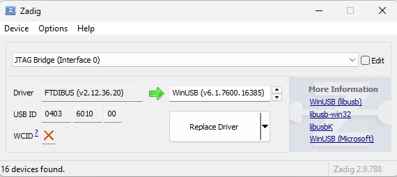
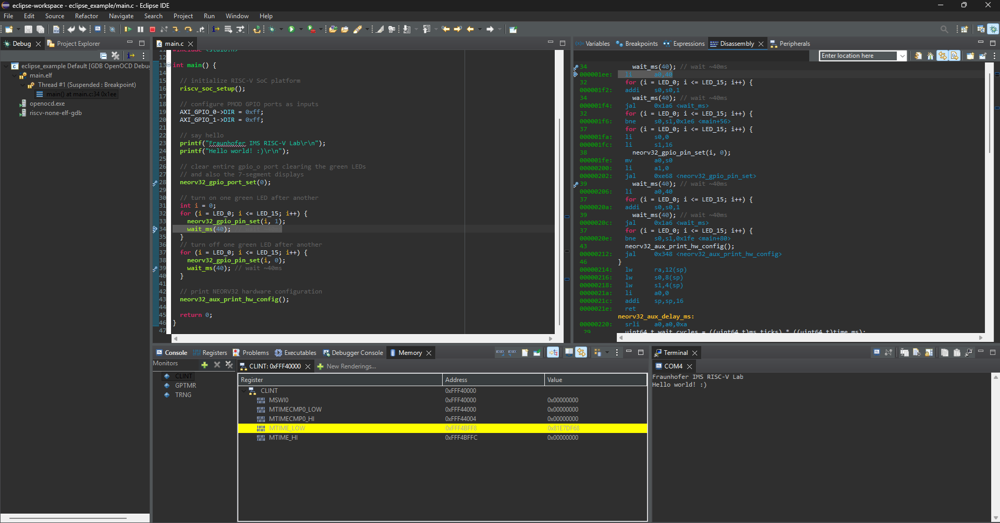

# Fraunhofer IMS RISC-V Lab

[](https://ims.fraunhofer.de/en.html)
[](https://github.com/Fraunhofer-IMS/riscv_lab/blob/main/LICENSE)

This repository hosts the _RISC-V Lab_, a collaborative educational project by
[Fraunhofer IMS](https://ims.fraunhofer.de/en.html) in cooperation with the
[University Duisburg-Essen](https://uni-due.de/en).

The goal of this lab is to give students hands-on experience with [RISC-V](https://riscv.org),
an open and free instruction set architecture that is shaping the future of computing. Within
this lab, students will explore a RISC-V–based platform implemented on the
[Digilent Nexy A7](https://digilent.com/reference/programmable-logic/nexys-a7/start) FPGA
development board using a fully open-source and royalty-free soft-core processor.

Initially, the setup is used much like a simple microcontroller platform - ideal for getting started
with embedded programming and digital design. Later exercises may extend into system-level topics
such as custom accelerators and interfaces, hardware/software co-design, and verification.

[](https://riscv.org)

We welcome contributions! If you encounter issues or have suggestions, please use GitHub
[Issues](https://github.com/Fraunhofer-IMS/riscv_lab/issues) or the
[Discussions](https://github.com/Fraunhofer-IMS/riscv_lab/discussions) board for feedback.
Pull requests are highly appreciated! For academic or organizational inquiries,
please contact the lab staff:

* :mailbox: **T.B.A.**


## Prerequisites

Clone this repository using `git`. Note that this repository uses submodules. Hence, you need to clone
recursively to include all submodules.

```bash
git clone --recurse-submodules https://github.com/Fraunhofer-IMS/riscv_lab.git
```

> [!WARNING]
> If you just use the _Download_ button the **submodules will not be included** and have to be downloaded and installed manually.

Further hardware and software requirements:

* [Digilent Nexy A7](https://digilent.com/reference/programmable-logic/nexys-a7/start) FPGA development board
* A JTAG adapter like the low-cost [Espressif ESP-Prog](https://docs.espressif.com/projects/esp-iot-solution/en/latest/hw-reference/ESP-Prog_guide.html).
Basically, you can use any FTDI-based interface board.
* A serial terminal program. On Linux, you can use _PuTTY_, for example. For Windows, [Tera Term](https://github.com/TeraTermProject/teraterm/releases) works well.
* A precompiled embedded RISC-V GCC toolchain like [xPack GNU RISC-V Embedded GCC](https://github.com/xpack-dev-tools/riscv-none-elf-gcc-xpack/releases).
* A precompiled version of openOCD like [xPack OpenOCD](https://github.com/xpack-dev-tools/openocd-xpack/releases).
* On Windows machines you also need _build tools_ like `make`. For example, you can use [xPack Windows Build Tools](https://github.com/xpack-dev-tools/windows-build-tools-xpack/releases).
* [Eclipse IDE for Embedded C/C++ Developers](https://eclipse.org/downloads/packages/release/2025-09/r/eclipse-ide-embedded-cc-developers)
* If you want to modify or rebuild the SoC design, a free version of [AMD Vivado](https://xilinx.com/support/download.html) is required.
**:warning: Use Vivado 2024.2 or higher.** If you just want to configure the FPGA, the "Vivado Lab Solutions" are sufficient.

### JTAG Adapter

The Espressif ESP-Prog adapter provides a dual-channel FTDI USB bridge interface. Channel 0 is used
for the 10-pin JTAG interface. Channel 1 is used for the native 6-pin ESP32 program interface. When
the adapter is connected to the computer for the first time, the two interface channels are registered
as individual virtual COM ports. In order for openOCD to use the ESP-prog as JTAG adapter, the driver
for **interface 0** must be changed.

#### Driver Installation on Windows

1. Download the Zadig USB driver tool: https://zadig.akeo.ie
2. **Disconnect** the Nexys A7 FPGA board from your computer as well as any other FTDI-based interfaces.
3. Plug in the ESP-Prog board and start Zadig. **:warning: Starting Zadig requires administrator privileges.**
4. Within Zadig, click "Options" and then "List all devices". Open the drop down menu and look for two instances of "Dual RS232 Interface" or "JTAG-Bridge".
5. Select `Interface 0`.
6. The current driver (left side) should be "FTDIBUS". Select "WinUSB" (right side) as the new driver and click "_Replace Driver_".
7. Changing the driver may take some minutes.



#### Driver Installation on Linux

:construction: under construction

### Vivado Hardware Project

Optionally, the SoC design of the FPGA can be re-build and modified.
The [`fpga`](fpga) folder contains all requires scripts, constraint files and additional RTL resources.
A README is provides to guide through the Vivado project setup.

> [!TIP]
> Pre-compiled bitstreams will be made available as release assets.

### Eclipse Software Project

Start coding by importing the provided [Eclipse example project](https://github.com/stnolting/neorv32/tree/main/sw/example/eclipse).
A step-by-step tutorial can be found [here](https://stnolting.github.io/neorv32/ug/#_eclipse_ide).




## RISC-V SoC

The SoC implemented on the FPGA is based on the free and open-source
[NEORV32 project](https://github.com/stnolting/neorv32). It implements a
RISC-V-compatible CPU together with on-chip memory and peripherals,
forming a customizable, microcontroller-like setup.

The specific configuration of the SoC can be determined by software by querying dedicated information registers
(e.g., memory sizes, cache layout, UART FIFO depths, etc.). The demo program provided in the [`sw`](sw) folder, for
example, prints the exact hardware configuration via UART. Experienced users can also refer to the TCL script of
the Vivado project for configuration details.

Detailed information such as technical specifications, tutorials, and software references
can be found at the following links:

* [data sheet](https://stnolting.github.io/neorv32)
* [user guide](https://stnolting.github.io/neorv32/ug)
* [API reference](https://stnolting.github.io/neorv32/sw/files.html)
* [example programs](https://github.com/stnolting/neorv32/tree/main/sw/example)

See the official [RISC-V ISA specification](https://github.com/riscv/riscv-isa-manual/releases)
for more information regarding the instruction set architecture.


## On-Board Peripherals

The Nexys A7 FPGA board offers a wide range of on-board peripherals and interfaces.
We recommend that you familiarize yourself with the
[Nexy A7 reference manual](https://digilent.com/reference/programmable-logic/nexys-a7/reference-manual)
before working with the board.

Most of the basic peripherals are connected to the RISC-V SoC. You can find the high-level
block diagram in the [`fpga`](fpga) folder. A simple demo program that illustrates the use
of the LEDs can be found in the [`sw`](sw) folder, which also provides hardware abstraction
layer (HAL) to simplify access to the basic board peripherals.

### Clock & Reset

The FPGA is clocked by an on-board 100MHz quartz oscillator. This clock signal is used for the RISC-V core and all
peripherals. There is a red button labeled "CPU RESET" on the board which can be used to reset the entire SoC at
any time.

| Module | FPGA pin | Top port     | NEORV32 port |
|:-------|:--------:|:------------:|:------------:|
| Clock  | E3       | `CLK100`     | `clk_i`      |
| Reset  | C12      | `CPU_RESETN` | `rstn_i`     |

There is a second red button labeled "PROG". When this button is pressed, the FPGA is reconfigured with the default
bitstream stored in the on-board SPI flash. The configuration is complete when the "DONE" LED lights up.

### USB-UART Bridge

The USB port, which is also used for power supply and for configuring the FPGA, additionally provides a
virtual COM port that can be used for serial communication via UART. It is connected to the SoC's
[primary UART](https://stnolting.github.io/neorv32/#_primary_universal_asynchronous_receiver_and_transmitter_uart0).
Note that this UART interface is used as standard console for IO functions like `printf()`.
Optional hardware flow control signals (RTS & CTS) are provided. However, these signals are
disabled by default by the software.

| Module             | FPGA pin | Top port       | NEORV32 port   |
|:-------------------|:--------:|:--------------:|:--------------:|
| UART receive data  | C4       | `UART_TXD_IN`  | `uart0_txd_o`  |
| UART transmit data | D4       | `UART_RXD_OUT` | `uart0_rxd_i`  |
| UART clear to send | D3       | `UART_CTS`     | `uart0_rtsn_o` |
| UART ready to send | E5       | `UART_RTS`     | `uart0_ctsn_i` |

By default, a "`19200-8-N-1`" configuration is used. However, application software can change the Baud rate to
increase UART communication speed.

* Baud rate: 19200
* Data bits: 8
* Parity: none
* Stop bits: 1

> [!TIP]
> If you don't have a JTAG adapter available, you can also use the USB-UART bridge to load
programs onto the SoC using the [bootloader](https://stnolting.github.io/neorv32/#_bootloader).

### Green LEDs

The 16 green LEDs (_LED0_ to _LED15_) are driven by the lowest 16 bits of the
SoC's [GPIO controller](https://stnolting.github.io/neorv32/#_general_purpose_input_and_output_port_gpio).
output port. All LEDs are high-active.

| Module | FPGA pin | Top port | NEORV32 port |
|:-------|:--------:|:--------:|:------------:|
| LED0   | H17      |`LED[0]`  | `gpio_o(0)`  |
| LED1   | K15      |`LED[1]`  | `gpio_o(1)`  |
| LED2   | J13      |`LED[2]`  | `gpio_o(2)`  |
| LED3   | N14      |`LED[3]`  | `gpio_o(3)`  |
| LED4   | R18      |`LED[4]`  | `gpio_o(4)`  |
| LED5   | V17      |`LED[5]`  | `gpio_o(5)`  |
| LED6   | U17      |`LED[6]`  | `gpio_o(6)`  |
| LED7   | U16      |`LED[7]`  | `gpio_o(7)`  |
| LED8   | V16      |`LED[8]`  | `gpio_o(8)`  |
| LED9   | T15      |`LED[9]`  | `gpio_o(9)`  |
| LED10  | U14      |`LED[10]` | `gpio_o(10)` |
| LED11  | T16      |`LED[11]` | `gpio_o(11)` |
| LED12  | V15      |`LED[12]` | `gpio_o(12)` |
| LED13  | V14      |`LED[13]` | `gpio_o(13)` |
| LED14  | V12      |`LED[14]` | `gpio_o(14)` |
| LED15  | V11      |`LED[15]` | `gpio_o(15)` |

### Seven-Segment Displays

The 8 seven-segment displays are controlled by upper-most 16 bits of the
SoC's [GPIO controller](https://stnolting.github.io/neorv32/#_general_purpose_input_and_output_port_gpio).
output port. Note that all output ports are inverted internally by the SoC. Hence, the individual anode of
each display as well as the global segment signals are high-active for the RISC-V.

The segment control lines of the 8 individual digits are controlled in parallel. In order to display different
symbols on all digits, the display must be operated in time multiplex mode. To do this, the common anodes of the
individual digits must be activated individually and set together with the segment control. The digits are
enumerated from right to left where the right-most digit used anode 0 and the left-mode display uses anode 7.

| Module        | FPGA pin | Top port | NEORV32 port |
|:--------------|:--------:|:--------:|:------------:|
| Segment A     | T10      |`SEG[0]`  | `gpio_o(16)` |
| Segment B     | R10      |`SEG[1]`  | `gpio_o(17)` |
| Segment C     | K16      |`SEG[2]`  | `gpio_o(18)` |
| Segment D     | K13      |`SEG[3]`  | `gpio_o(19)` |
| Segment E     | P15      |`SEG[4]`  | `gpio_o(20)` |
| Segment F     | T11      |`SEG[5]`  | `gpio_o(21)` |
| Segment G     | L18      |`SEG[6]`  | `gpio_o(22)` |
| Segment DP    | H15      |`SEG[7]`  | `gpio_o(23)` |
| Anode digit 0 | J17      |`AN[0]`   | `gpio_o(24)` |
| Anode digit 1 | J18      |`AN[1]`   | `gpio_o(25)` |
| Anode digit 2 | T9       |`AN[2]`   | `gpio_o(26)` |
| Anode digit 3 | J14      |`AN[3]`   | `gpio_o(27)` |
| Anode digit 4 | P14      |`AN[4]`   | `gpio_o(28)` |
| Anode digit 5 | T14      |`AN[5]`   | `gpio_o(29)` |
| Anode digit 6 | K2       |`AN[6]`   | `gpio_o(30)` |
| Anode digit 7 | U13      |`AN[7]`   | `gpio_o(31)` |

### RGB LEDs

The individual LEDs of each RGB LED are driven by the SoC's
[PWM controller](https://stnolting.github.io/neorv32/#_pulse_width_modulation_controller_pwm).
By adjusting the brightness (= PWM duty cycle) of the three color channels, virtually any color can be created.

| Module      | FPGA pin | Top port  | NEORV32 port |
|:------------|:--------:|:---------:|:------------:|
| LED16.red   | N15      | `RGB0[0]` | `pwm_o(0)`   |
| LED16.green | M16      | `RGB0[1]` | `pwm_o(1)`   |
| LED16.blue  | R12      | `RGB0[2]` | `pwm_o(2)`   |
| LED17.red   | N16      | `RGB1[0]` | `pwm_o(3)`   |
| LED17.green | R11      | `RGB1[1]` | `pwm_o(4)`   |
| LED17.blue  | G14      | `RGB1[2]` | `pwm_o(5)`   |

### Switches

The 16 switches are directly connected to the input port of the SoC's
[GPIO controller](https://stnolting.github.io/neorv32/#_general_purpose_input_and_output_port_gpio).
Note that the switches do not provide any de-bouncing circuitry.

| Module | FPGA pin | Top port | NEORV32 port |
|:-------|:--------:|:--------:|:------------:|
| SW0    | J15      | `SW[0]`  | `gpio_i(0)`  |
| SW1    | L16      | `SW[1]`  | `gpio_i(1)`  |
| SW2    | M13      | `SW[2]`  | `gpio_i(2)`  |
| SW3    | R15      | `SW[3]`  | `gpio_i(3)`  |
| SW4    | R17      | `SW[4]`  | `gpio_i(4)`  |
| SW5    | T18      | `SW[5]`  | `gpio_i(5)`  |
| SW6    | U18      | `SW[6]`  | `gpio_i(6)`  |
| SW7    | R13      | `SW[7]`  | `gpio_i(7)`  |
| SW8    | T8       | `SW[8]`  | `gpio_i(8)`  |
| SW9    | U8       | `SW[9]`  | `gpio_i(9)`  |
| SW10   | R16      | `SW[10]` | `gpio_i(10)` |
| SW11   | T13      | `SW[11]` | `gpio_i(11)` |
| SW12   | H6       | `SW[12]` | `gpio_i(12)` |
| SW13   | U12      | `SW[13]` | `gpio_i(13)` |
| SW14   | U11      | `SW[14]` | `gpio_i(14)` |
| SW15   | V10      | `SW[15]` | `gpio_i(15)` |

### Buttons

The 5 directional buttons are also directly connected to the input port of the SoC's
[GPIO controller](https://stnolting.github.io/neorv32/#_general_purpose_input_and_output_port_gpio).
The buttons are high-active and provide pull-down resistors. However, they do not provide
any de-bouncing circuitry.

| Module        | FPGA pin | Top port  | NEORV32 port |
|:--------------|:--------:|:---------:|:------------:|
| BTNC (center) | N17      | `BTN[0]`  | `gpio_i(16)` |
| BTNU (up)     | M18      | `BTN[1]`  | `gpio_i(17)` |
| BTNL (left)   | P17      | `BTN[2]`  | `gpio_i(18)` |
| BTNR (right)  | M17      | `BTN[3]`  | `gpio_i(19)` |
| BTND (down)   | P18      | `BTN[4]`  | `gpio_i(20)` |

### Audio Jack

The on-board audio output is driven by another channel of the SoC's
[PWM controller](https://stnolting.github.io/neorv32/#_pulse_width_modulation_controller_pwm).
The amplifier is always enabled (`AUD_SD` is always high).

| Module     | FPGA pin | Top port  | NEORV32 port |
|:-----------|:--------:|:---------:|:------------:|
| Mono audio | A11      | `AUD_PWM` | `pwm_o(6)`   |
| Amp enable | D12      | `AUD_SD`  | -            |

### I2C Temperature Sensor

The on-board I²C/TWI temperature sensor is connected to the SoC's
[TWI controller](https://stnolting.github.io/neorv32/#_two_wire_serial_interface_controller_twi).

The temperature sensor is accessible via the 8-bit I²C address `0x96` (7-bit + zero = write address).
The FPGA setup already provides the required pull-up resistors.

| Module       | FPGA pin | Top port  | NEORV32 port             |
|:-------------|:--------:|:---------:|:------------------------:|
| Serial clock | C14      | `TMP_SCL` | `twi_scl_i`, `twi_scl_o` |
| Serial data  | C15      | `TMP_SDA` | `twi_sda_i`, `twi_sda_o` |

### SPI Flash

The on-board SPI flash is actually used to store the configuration/bitstream of the FPGA in order to
load it directly after power-up. However, the FPGA's bitstream (~4MB) does not occupy the entire flash,
the upper part (starting at address `0x00400000`) can also be used for custom applications.

> [!TIP]
> The SPI flash can be used by the default [bootloader](https://stnolting.github.io/neorv32/#_bootloader)
for non-volatile application program storage.

The flash is connected to the SoC's
[SPI controller](https://stnolting.github.io/neorv32/#_serial_peripheral_interface_controller_spi).
SPI flash and micro SD card use the same SPI interface but have individual chip-select lines.
The SPI flash is connected to SPI chip select 0.

| Module            | FPGA pin | Top port    | NEORV32 port   |
|:------------------|:--------:|:-----------:|:--------------:|
| Flash clock       | E9       | -           | `spi_clk_o`    |
| Flash data out    | K17      | `FLASH_SDI` | `spi_dat_i`    |
| Flash data in     | K18      | `FLASH_SDO` | `spi_dat_o`    |
| Flash chip-select | L13      | `FLASH_CSN` | `spi_csn_o(0)` |

### Micro SD Card Slot

The SD card is used in native SPI mode and is connected to the SoC's
[SPI controller](https://stnolting.github.io/neorv32/#_serial_peripheral_interface_controller_spi).
SPI flash and micro SD card use the same SPI interface but have individual chip-select lines.
The SD card is connected to SPI chip select 1. The SD card is always enabled (`SD_RST` is always high).

| Module              | FPGA pin | Top port | NEORV32 port   |
|:--------------------|:--------:|:--------:|:--------------:|
| SD card reset       | E2       | `SD_RST` | -              |
| SD card clock       | B1       | `SD_SCK` | `spi_clk_o`    |
| SD card data out    | C1       | `SD_SDI` | `spi_dat_i`    |
| SD card data in     | C2       | `SD_SDO` | `spi_dat_o`    |
| SD card chip-select | D2       | `SD_CSN` | `spi_csn_o(1)` |

> [!TIP]
> An FAT32-formatted SD card can be used by the default [bootloader](https://stnolting.github.io/neorv32/#_bootloader)
to boot an executable right from the card.

## PMOD Connectors

The Nexys A7 boards provides four digital PMOD connectors (JA, JB, JC, JD) that can be used
to attach custom peripheral boards and interfaces. The IOs of each PMOD have series resistors
to prevent short circuits caused by reverse polarity or incorrectly connected modules.

Each PMOD provides 12 pins: 8 digital IOs, 2 pins for ground ("GND"), and 2 pins for a 3.3 Volt supply ("3V3").
The total current consumption of all PMODs should not exceed 500mA.

```
     ________________________
    /                       /|
   +---+---+---+---+---+---+ |
   |3V3|GND| 4 | 3 | 2 | 1 | |
   +---+---+---+---+---+---+ |
   |3V3|GND| 10| 9 | 8 | 7 |/
---+---+---+---+---+---+---+---
PMOD connector pinout (front-view)
```

### PMOD JA & PMOD JXADC

These PMOD connector are not used yet. Do not connect anything to them.

### PMOD JB - AXI-GPIO-0

This PMOD provides a configurable general-purpose 8-bit bi-directional GPIO port. Note that this
port is **not** controlled directly by the RISC-V core; instead, it is controlled by an
[AMD AXI-GPIO](https://docs.amd.com/v/u/en-US/pg144-axi-gpio) controller that is connected to the
[external bus interface](https://stnolting.github.io/neorv32/#_processor_external_bus_interface_xbus)
of the RISC-V core.

The base address of this AXI-GPIO controller is `0xF0000000`. All PMDO GPIO pins provide FPGA-internal
weak pull-up resistors. The AXI-GPIO-0 provides an input pin-change interrupt (high-active) that is routed to the
[GPIO controller](https://stnolting.github.io/neorv32/#_general_purpose_input_and_output_port_gpio)
at `gpio_i(21)`.

| PMOD Pin | Function         | FPGA pin | Top port |
|:---------|:-----------------|:--------:|:--------:|
| 1        | AXI-GPIO-0 pin 0 | D14      | `JB[0]`  |
| 2        | AXI-GPIO-0 pin 1 | F16      | `JB[1]`  |
| 3        | AXI-GPIO-0 pin 2 | G16      | `JB[2]`  |
| 4        | AXI-GPIO-0 pin 3 | H14      | `JB[3]`  |
| 5        | Ground (GND)     | -        | -        |
| 6        | +3.3V            | -        | -        |
| 7        | AXI-GPIO-0 pin 4 | E16      | `JB[4]`  |
| 8        | AXI-GPIO-0 pin 5 | F13      | `JB[5]`  |
| 9        | AXI-GPIO-0 pin 6 | G13      | `JB[6]`  |
| 10       | AXI-GPIO-0 pin 7 | H16      | `JB[7]`  |
| 11       | Ground (GND)     | -        | -        |
| 12       | +3.3V            | -        | -        |

### PMOD JC - AXI-GPIO-1

This PMOD provides a configurable general-purpose 8-bit bi-directional GPIO port. Note that this
port is **not** controlled directly by the RISC-V core; instead, it is controlled by an
[AMD AXI-GPIO](https://docs.amd.com/v/u/en-US/pg144-axi-gpio) controller that is connected to the
[external bus interface](https://stnolting.github.io/neorv32/#_processor_external_bus_interface_xbus)
of the RISC-V core.

The base address of this AXI-GPIO controller is `0xF0010000`. All PMDO GPIO pins provide FPGA-internal
weak pull-up resistors. The AXI-GPIO-1 also provides an input pin-change interrupt (high-active) that is routed to the
[GPIO controller](https://stnolting.github.io/neorv32/#_general_purpose_input_and_output_port_gpio)
at `gpio_i(22)`.

| PMOD Pin | Function         | FPGA pin | Top port |
|:---------|:-----------------|:--------:|:--------:|
| 1        | AXI-GPIO-1 pin 0 | K1       | `JC[0]`  |
| 2        | AXI-GPIO-1 pin 1 | F6       | `JC[1]`  |
| 3        | AXI-GPIO-1 pin 2 | J2       | `JC[2]`  |
| 4        | AXI-GPIO-1 pin 3 | G6       | `JC[3]`  |
| 5        | Ground (GND)     | -        | -        |
| 6        | +3.3V            | -        | -        |
| 7        | AXI-GPIO-1 pin 4 | E7       | `JC[4]`  |
| 8        | AXI-GPIO-1 pin 5 | J3       | `JC[5]`  |
| 9        | AXI-GPIO-1 pin 6 | J4       | `JC[6]`  |
| 10       | AXI-GPIO-1 pin 7 | E6       | `JC[7]`  |
| 11       | Ground (GND)     | -        | -        |
| 12       | +3.3V            | -        | -        |

### PMOD JD - RISC-V JTAG

This PMOD port provides access to the RISC-V
[On-Chip Debugger](https://stnolting.github.io/neorv32/#_on_chip_debugger_ocd) via a standard JTAG port.
Four signal wires and one ground wire are required to connect the PMOD pins to the according ESP-prog pins.

> [!IMPORTANT]
> Do not connect any 3.3V PMOD pin to the ESP-prog board!

| PMOD Pin | Function | FPGA pin | Top port   | NEORV32 port |
|:---------|:---------|:--------:|:----------:|:------------:|
| 1        | TDI      | H4       | `JTAG_TDI` | `jtag_tdi_i` |
| 2        | TDO      | H1       | `JTAG_TDO` | `jtag_tdo_o` |
| 3        | TCK      | G1       | `JTAG_TCK` | `jtag_tck_i` |
| 4        | TMS      | G3       | `JTAG_TMS` | `jtag_tms_i` |
| 5        | GND      | -        | -          | -            |


## Legal

This project is released under the permissive BSD-3-clause license.
See [`LICENSE`](LICENSE) for more information.

Copyright (c) 2025 by Fraunhofer Institute for Microelectronic Circuits and Systems (_Fraunhofer IMS_).\
Finkenstrasse 61, 47057 Duisburg, Germany.\
https://ims.fraunhofer.de/en.html


### Proprietary Notice

* "Nexys" is a trademark of Digilent Inc.
* "Vivado" and "Artix" are trademarks of AMD Inc.
* "AXI", "AXI4", "AXI4-Lite" and "AXI4-Stream" are trademarks of Arm Holdings plc.
* "Windows" is a trademark of Microsoft Corporation.
* "ESP" is a trademark of Espressif Systems (Shanghai) Co., Ltd.
* "Eclipse" is trademark of the Eclipse Foundation.
* "PuTTY" copyright by Simon Tatham.
* "Tera Term" copyright by T. Teranishi.
* "Zadig" copyright by Pete Batard.

All further/unreferenced projects/products/brands belong to their according copyright holders.
No copyright infringement intended.

### Limitation of Liability for External Links

This document contains links to the websites of third parties ("external links"). As the content of these websites
is not under our control, we cannot assume any liability for such external content. In all cases, the provider of
information of the linked websites is liable for the content and accuracy of the information provided. At the
point in time when the links were placed, no infringements of the law were recognizable to us. As soon as an
infringement of the law becomes known to us, we will immediately remove the link in question.
