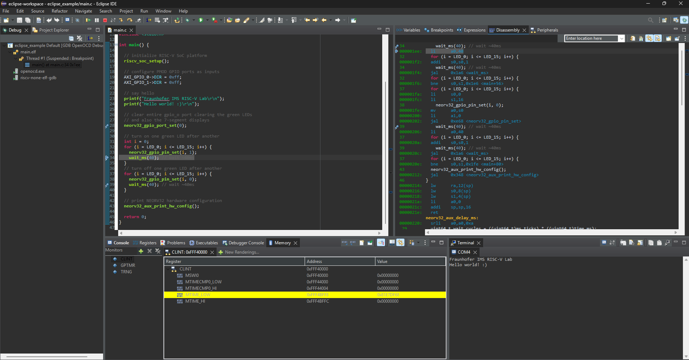
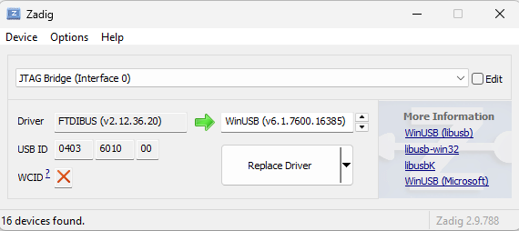

# Eclipse Demo Project



## Importing the Project

1. Start Eclipse IDE.
2. Click on **File > Import**, expand **General** and select **"Projects from Folder or Archive"**.
3. Click **Next**.
4. Click on **Directory** and select _this_ folder (`path/to/riscv_lab/eclipse`).
5. Click **Finish**.

> [!NOTE]
> When code is to be executed on the processor for the first time, a debug launch configuration must first be selected.
Click on the tiny arrow left to "GDB OpenOCD Debugging", select `eclipse_riscv_lab Default.launch` and click "Debug".

> [!TIP]
> This example project provides a simple hardware abstraction layer (HAL)
for the board's basic IO peripherals in `riscv_soc.h`.


## Tool Setup

Download and install the
[Eclipse IDE for Embedded C/C++ Developers](https://www.eclipse.org/downloads/packages/release/2025-09/r/eclipse-ide-embedded-cc-developers).
Besides that, additional software tools are required. Download the release versions and extract them into a folder on your machine.

* Precompiled embedded RISC-V GCC toolchain like [xPack GNU RISC-V Embedded GCC](https://github.com/xpack-dev-tools/riscv-none-elf-gcc-xpack/releases).
* Precompiled openOCD like [xPack OpenOCD](https://github.com/xpack-dev-tools/openocd-xpack/releases).
* On Windows machines you also need _build tools_ like `make`. For example, you can use [xPack Windows Build Tools](https://github.com/xpack-dev-tools/windows-build-tools-xpack/releases).

### RISC-V GCC Toolchain

The GCC compiler suite is used to compile, assemble and link C/C++ code into
into an actual executable that can be executed on the RISC-V SoC.

1. Right-click on the project in the left view, select **Properties**.
2. Expand **MCU** and select **RISC-V Toolchain Paths**.
3. Adjust the **Toolchain folder**. Select the `bin` folder of your RISC-V GCC installation (e.g. `C:\xpack\xpack-riscv-none-elf-gcc-14.2.0-2\bin`).
4. Click **Apply**.

### Build Tools

The build tools provide helper tools like `make`. This step is only required if your
system (e.g. plain Windows) does not provide any build tools itself.

1. In the project explorer right-click on the project and select **Properties**.
2. Expand **MCU** and click on **Build Tools Path**.
3. Configure the **Build tools folder**. Select the `bin` folder of your build tools installation (e.g. `C:\xpack\xpack-windows-build-tools-4.4.1-3\bin`).
4. Click **Apply**.

### openOCD

OpenOCD is used as low-level JTAG interface to connect the on-chip debugger of the RISC-V
SoC and the GCC debugger within Eclipse.

1. In the project explorer right-click on the project and select **Properties**.
2. Expand **MCU** and select **OpenOCD Path**.
3. Configure the **Folder** according to your openOCD installation (e.g. `C:\xpack\xpack-openocd-0.12.0-6\bin`).
4. Click **Apply and Close**.


## JTAG Adapter

The low-cost [Espressif ESP-Prog](https://docs.espressif.com/projects/esp-iot-solution/en/latest/hw-reference/ESP-Prog_guide.html)
is used as simple JTAG adapter within this lab. It provides a dual-channel FTDI USB bridge interface. Channel 0 is used
for the 10-pin JTAG interface. Channel 1 is used for the native 6-pin ESP32 program interface. When
the adapter is connected to the computer for the first time, the two interface channels are registered
as individual virtual COM ports. In order for openOCD to use the ESP-prog as JTAG adapter, the driver
for **interface 0** must be changed.

### Driver Installation on Windows

1. Download the Zadig USB driver tool: https://zadig.akeo.ie
2. **Disconnect** the Nexys A7 FPGA board from your computer as well as any other FTDI-based interfaces.
3. Plug in the ESP-Prog board and start Zadig.

> [!WARNING]
> Starting Zadig requires administrator privileges.

4. Within Zadig, click "Options" and then "List all devices". Open the drop down menu and look for two instances of "Dual RS232 Interface" or "JTAG-Bridge".
5. Select `Interface 0`.
6. The current driver (left side) should be "FTDIBUS". Select "WinUSB" (right side) as the new driver and click "Replace Driver".
7. Changing the driver may take some minutes.



### Driver Installation on Linux

:construction: T.B.A.


## Demo Program

The provided minimal demo program `main.c` initializes the SoC platform, blinks the green LEDs
and prints configuration info via the on-board USB-UART interface (19200-8-N-1 configuration):

```
Fraunhofer IMS RISC-V Lab
Hello world! :)


<< NEORV32 Processor Configuration >>

Is simulation:       no
CPU cores (harts):   1
Clock speed:         100000000 Hz
On-chip debugger:    enabled, 4 HW trigger(s)
Hart ID:             0x00000000
Architecture ID:     0x00000013
Implementation ID:   0x01120501 (v1.12.5.1)
Architecture:        rv32-little
ISA extensions:      C I M U X Sdext Sdtrig Smpmp Zca Zicntr Zicsr Zifencei Zihpm Zkt 
Tuning options:      trace fast_mul fast_shift 
Phys. Memory Prot.:  4 region(s), 16384 bytes granularity, modes = OFF TOR NAPOT
HPM counters:        4 counter(s), 64 bit(s) wide
Boot configuration:  boot via bootloader (0)
Internal IMEM:       262144 bytes
Internal DMEM:       65536 bytes
CPU I-cache:         2048 bytes (32x64), bursts enabled
CPU D-cache:         1024 bytes (16x64), bursts enabled
Ext. bus interface:  enabled, bursts enabled
Bus timeout (int):   2048 cycles
Bus timeout (ext):   2048 cycles
Peripherals:         CLINT GPIO GPTMR PWM SPI SYSINFO TRACER TRNG TWI UART0 WDT
```
